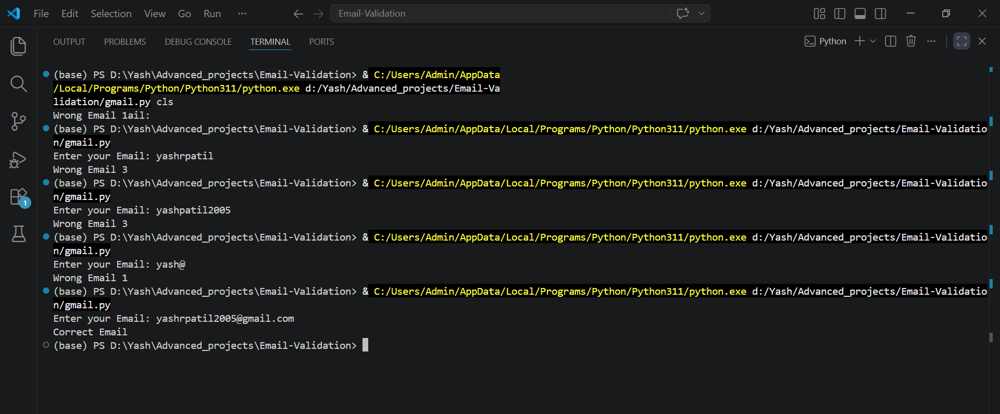

# 📧 Email Validation System (Python)

## 📌 Project Description
This is a simple Python-based Email Validation System that checks whether an email is valid based on multiple conditions.

## ✅ Features
- Minimum length check
- First character must be alphabet
- Only one '@' allowed
- Dot (.) position validation
- No spaces allowed
- No uppercase letters allowed
- Only valid characters allowed

## 🧠 Logic Used
- String handling
- Conditional statements
- Loops
- Built-in functions (isalpha, isdigit, isupper, etc.)

## 📸 Output Screenshot



## ▶️ How to Run
```bash
python gmail.py

